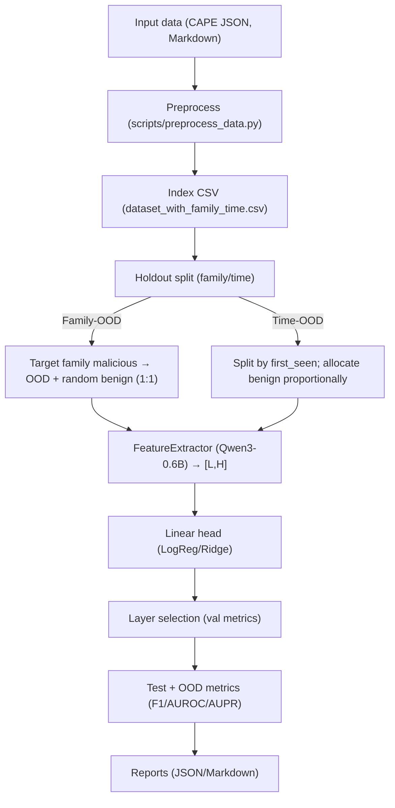

# MELD: LLM-based Unknown Malware Detection with Layered Evidence

> Use layer-wise hidden states from Qwen3-0.6B to build document-level representations for malware detection and OOD evaluation (Family-OOD, Time-OOD) with lightweight linear heads. The system is engineering-focused, reproducible, and extensible.

## Highlights
- Simple and effective: LLM intermediate representations + linear heads (LogReg/Ridge). Lightweight to train and infer.
- Long-document friendly: Markdown reports are windowed with stride, mean-pooled per layer, and averaged across chunks to produce document-level layer vectors.
- Principled OOD evaluation: Family-OOD (holdout family) and Time-OOD (temporal holdout) pipelines with layer selection and threshold scanning.
- One-command experiments: scripted preprocessing, system verification, per-family/batch runs, and Markdown/JSON reporting.


## Architecture / Flow


## Repository layout (key parts)
- Core: `src/meld`
  - `feature_extractor.py`: layer-wise feature extraction for Qwen3-0.6B, chunked long-text processing with masked mean pooling.
  - `holdout_family_time.py`: Family-OOD / Time-OOD splits, training, validation/test, per-layer selection, and metrics.
  - `ood_eval.py`: minimal OOD evaluation with multiple scores.
  - `meld_family_classifier.py`: multi-class family classification (non-OOD).
- Experiments: `experiments/`
  - `family_ood/run_family_ood.py`: per-family or batch holdout with auto per-family and summary reports.
  - `time_ood/run_time_ood.py`: time-based holdout with auto report.
- Data/Models/Results: `data/processed/`, `models/qwen3-0.6b/`, `results/`
- Runners & tools: `scripts/` (e.g., `preprocess_data.py`, `run_experiments.py`, `verify_meld_system.sh`)
- Detailed guide: `Experiment.md`

## Quickstart
### 1) Install and verify
```bash
uv sync
uv run python -c "import torch, transformers, sklearn, pandas, numpy; print('✅ env ok')"
```

### 2) Prepare models
```bash
uv run python scripts/download_models.py
ls -la models/
```

### 3) Prepare data (use provided processed data or convert your own)
- Place CAPE data under `input/` or reuse the provided processed examples.
- Build index:
```bash
uv run python scripts/preprocess_data.py \
  --input data/processed \
  --output data/processed
```
Artifacts: `data/processed/dataset_with_family_time.csv`, `data/processed/dataset_stats.json`

## Run experiments
### Time-OOD (temporal holdout)
```bash
uv run python experiments/time_ood/run_time_ood.py \
  --data_dir data/processed \
  --model_dir models/qwen3-0.6b \
  --output results/time_ood/meld_time_ood_results.json
```

### Family-OOD (family holdout)
- Single family (e.g., AgentTesla)
```bash
uv run python experiments/family_ood/run_family_ood.py \
  --target_family AgentTesla \
  --data_dir data/processed \
  --model_dir models/qwen3-0.6b
```
- Batch (Top-8 families: AgentTesla, AsyncRAT, Formbook, LummaStealer, MassLogger, RemcosRAT, SnakeKeylogger, Stealc)
```bash
uv run python experiments/family_ood/run_family_ood.py --batch
```
- Quick small-sample validation (resource-friendly)
```bash
uv run python experiments/family_ood/run_family_ood.py --batch --max_samples 200
```

## Outputs and reports
- JSON: `results/time_ood/*.json`, `results/family_ood/meld_family_ood_{family}.json`
- Reports: `results/time_ood/time_ood_report.md`, `results/family_ood/family_ood_{family}_report.md`, `results/family_ood/family_ood_summary_report.md`
- Example outputs are included in `results/`.

## Method overview
- Feature extraction: Qwen3-0.6B exposes layer-wise hidden states. We masked-mean-pool per layer per chunk, then average across chunks to obtain document-level `[L, H]` representations.
- Classification & layer selection: train a linear head (`logreg`/`ridge`) on ID train/val, select the best layer by validation metrics (e.g., Macro F1), and report F1/AUROC/AUPR on test.
- Splitting strategies:
  - Family-OOD: the target family’s malicious samples form OOD positives; the test set is target-family malicious + randomly sampled benign (1:1). Train/val are from the remainder.
  - Time-OOD: malicious samples are split by `first_seen` threshold; benign samples lack timestamps and are allocated proportionally to pre/post periods to avoid leakage and class collapse.

## Common knobs
- Features: `--max_tokens`, `--stride`, `--until_layer`
- Classifier: `--clf {logreg|ridge}`
- Subsampling: `--limit` or `--max_*_samples` (quick validation)
- Split: `--test_family`, `--time_threshold` (e.g., `2025-06-01`)

## System verification (recommended)
```bash
./scripts/verify_meld_system.sh
cat results/meld_system_verification_report.md
```

## Further reading
- See `Experiment.md` for a detailed reproduction guide and more command examples.
- Components live in `src/meld/` (`feature_extractor.py`, `holdout_family_time.py`, `ood_eval.py`, ...)

## License

This project is licensed under **[CC BY-NC-SA 4.0](https://creativecommons.org/licenses/by-nc-sa/4.0/)**:
- **BY (Attribution)**: You must give appropriate credit
- **NC (NonCommercial)**: For non-commercial use only  
- **SA (ShareAlike)**: Derivative works must use the same license

Third-party models/weights (e.g., Qwen3-0.6B) follow their own licenses and T&Cs (see `models/qwen3-0.6b/LICENSE`).

## Citation
If this repository or its ideas help your work, please cite it in your research or engineering documentation.
