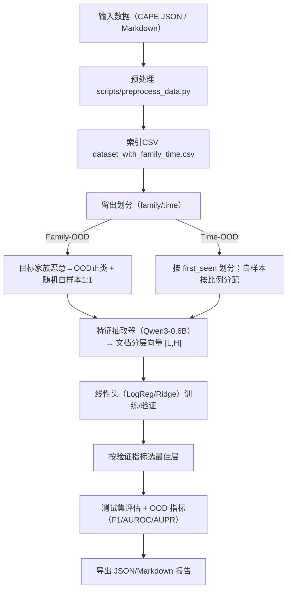

# MELD：基于大语言模型中间层表示的恶意软件检测与分布外评估

> **MELD: LLM-based Unknown Malware Detection with Layered Evidence**  
> 采用 Qwen3-0.6B 的逐层隐藏状态做文档级表征，配线性分类器（LogReg/Ridge），进行恶意/良性判别与 Family-OOD、Time-OOD 评测。

## 亮点
- 简洁有效：LLM 中间层表示 + 线性头（LogReg/Ridge），训练与推理轻量级。
- 长文本友好：Markdown 行为报告支持窗口化分块 + 掩码均值池化，生成文档级分层向量。
- OOD 评测规范：提供 Family-OOD（留出家族）与 Time-OOD（时间留出）两套切分与评测流程，含分层选优与阈值扫描。
- 一键复现实验：脚本化数据处理、系统验证、单家族/批量实验与报告生成；结果保存为 JSON 与 Markdown。


## 架构 / 调用流程


## 目录结构（关键）
- 核心代码：`src/meld`
  - `feature_extractor.py`：逐层特征抽取（Qwen3-0.6B），长文本分块 + 层级均值池化。
  - `holdout_family_time.py`：Family-OOD / Time-OOD 划分、训练、验证、测试、逐层选优与指标计算。
  - `ood_eval.py`：最小化 OOD 评测（含多种 OOD 分数）。
  - `meld_family_classifier.py`：家族多分类（非 OOD）。
- 实验脚本：`experiments/`
  - `family_ood/run_family_ood.py`：家族留出（单家族/批量），自动生成个人与汇总报告。
  - `time_ood/run_time_ood.py`：时间留出实验，自动生成报告。
- 数据/模型/结果：`data/processed/`、`models/qwen3-0.6b/`、`results/`
- 统一入口与工具：`scripts/`（如 `preprocess_data.py`、`run_experiments.py`、`verify_meld_system.sh`）
- 详细指南：`Experiment.md`

## 快速开始
### 1) 安装与验证
```bash
uv sync
uv run python -c "import torch, transformers, sklearn, pandas, numpy; print('✅ env ok')"
```

### 2) 准备模型
```bash
uv run python scripts/download_models.py
ls -la models/
```

### 3) 准备数据（可使用已有 processed 数据，或自行转换）
- 将 CAPE 原始数据放入 `input/`，或使用项目自带的已处理示例。
- 生成索引：
```bash
uv run python scripts/preprocess_data.py \
  --input data/processed \
  --output data/processed
```
产物：`data/processed/dataset_with_family_time.csv`、`data/processed/dataset_stats.json`

## 运行实验
### Time-OOD（时间留出）
```bash
uv run python experiments/time_ood/run_time_ood.py \
  --data_dir data/processed \
  --model_dir models/qwen3-0.6b \
  --output results/time_ood/meld_time_ood_results.json
```

### Family-OOD（家族留出）
- 单家族（示例：AgentTesla）
```bash
uv run python experiments/family_ood/run_family_ood.py \
  --target_family AgentTesla \
  --data_dir data/processed \
  --model_dir models/qwen3-0.6b
```
- 批量（Top-8 家族：AgentTesla, AsyncRAT, Formbook, LummaStealer, MassLogger, RemcosRAT, SnakeKeylogger, Stealc）
```bash
uv run python experiments/family_ood/run_family_ood.py --batch
```
- 快速小样本验证（资源有限推荐）
```bash
uv run python experiments/family_ood/run_family_ood.py --batch --max_samples 200
```

## 结果与报告
- JSON：`results/time_ood/*.json`、`results/family_ood/meld_family_ood_{family}.json`
- 报告：`results/time_ood/time_ood_report.md`、`results/family_ood/family_ood_{family}_report.md`、`results/family_ood/family_ood_summary_report.md`
- 示例输出已随仓库提供，可直接查看 `results/` 目录。

## 方法概述
- 特征抽取：Qwen3-0.6B 输出所有中间层隐藏状态；对每层做掩码均值池化并跨块平均，得到 `[L, H]` 的文档级分层表示。
- 分类与选层：在 ID 训练/验证上训练线性头（`logreg`/`ridge`），按验证指标（如 Macro F1）选择最佳层；在测试集报告 F1/AUROC/AUPR 等。
- 划分策略：
  - Family-OOD：将目标家族的恶意作为 OOD 正类，测试集由“目标家族恶意 + 随机白样本(1:1)”组成；训练/验证来自其余样本。
  - Time-OOD：恶意按 `first_seen` 阈值前后划分；白样本无时间戳，按比例分配到前/后时段以避免泄漏与类别坍缩。

## 常用参数
- 特征相关：`--max_tokens`、`--stride`、`--until_layer`
- 分类器：`--clf {logreg|ridge}`
- 子采样：`--limit` 或 `--max_*_samples`（快速验证）
- 划分：`--test_family`、`--time_threshold`（例如 `2025-06-01`）

## 系统验证（推荐）
```bash
./scripts/verify_meld_system.sh
cat results/meld_system_verification_report.md
```

## 进一步阅读
- 详细复现手册与更多命令示例见：`Experiment.md`
- 组件代码：`src/meld/`（`feature_extractor.py`、`holdout_family_time.py`、`ood_eval.py` 等）

## 许可证

本项目采用 **[CC BY-NC-SA 4.0](https://creativecommons.org/licenses/by-nc-sa/4.0/)** 许可证：
- **BY (署名)**：使用时须注明原作者
- **NC (非商业性)**：仅限非商业用途
- **SA (相同方式共享)**：修改后的作品需采用相同许可证

第三方模型与权重（如 Qwen3-0.6B）遵循其各自许可证与使用条款（见 `models/qwen3-0.6b/LICENSE`）。

## 引用
如本项目或其思想对你有帮助，请在学术或工程文档中引用本仓库。
